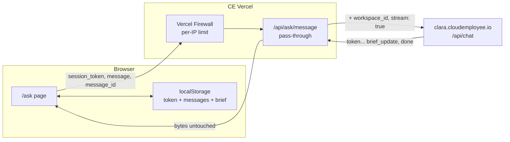

# CE-P3 — Ask Clara goes live

> **Type:** integration phase (CE repo only, no Clara code changes, no DB migration)
> **Branch base:** `main` @ `116f745` (deployed tip, confirmed 5 Aug 2026)
> **Branch:** `feat/ce-p3-ask-clara-live`
> **DB:** no migration in this phase. Clara owns all session storage.
> **Commit:** this brief is committed at authoring time, before any code.
> **Status:** LOCKED. Cross-model panel run `2026-08-05T10-57-43-451-tfnx` folded
> in (1 critical, 7 important, 3 minor). Halt on drift; log deviations as DEV-N.

---

## WHY

`/ask` is complete as a design surface and completely fake as a product. Every
conversation on it is a scripted mock: three canned scripts in
`site/src/lib/ask/clara/scripts.ts`, replayed sequentially, ignoring what the
visitor actually types.

CLARA-2 built the other half. Clara now runs a second AI pass after each reply,
extracts a structured hiring brief, and emits it as a `brief_update` event before
`done`. Nothing consumes it.

This phase joins them. After it, a real visitor has a real conversation and
watches a real brief assemble itself beside it.

It is deliberately the smallest possible joining. No design changes, no new
screens, no changes to the brief contract, and nothing at all in the Clara repo.

### Blocking prerequisite (Jake, before Step 0 completes)

**PR #2 on `galaxyfunk/clara-chatbot` is still OPEN.** `src/lib/chat/extract-brief.ts`
does not exist on `origin/main`, so production Clara emits no `brief_update` at
all. Merge and deploy it, or this phase ships a live conversation beside a card
that never fills.

No Vercel config is needed once it deploys. The extraction gate defaults to on:

```ts
// clara-chatbot src/lib/chat/extract-brief.ts:150-151
if (configured.length === 0) return true;
return configured.includes(workspaceId);
```

---

## LOCKED DECISIONS

| # | Decision | Rationale (Jake's, from the grill) |
|---|---|---|
| **D1** | Conversation + brief persist **30 days** in `localStorage`; visible "Start over" control, behind a confirm | Someone can come back and finish their brief. An accidental refresh must not destroy a part-built brief |
| **D2** | A broken stream **replaces** the half-finished reply with a fixed apology and a "Try again" control. The real error is logged server-side and **never** rendered | Cleanest to read, no retyping, no raw `Failed to fetch` shown to a buyer |
| **D3** | Rate limiting = **Vercel Firewall** per-IP rule on the route path. Plus an Anthropic spend alert. **No Redis.** Hardened by the audit with a fail-closed server flag so the route ships inert until the rule exists (Audit F6) | The threat is someone looping the URL; the firewall stops that at the edge for free. Redis adds a paid service and a new failure mode for no gain at zero traffic |
| **D4** | **Split copy source.** Opening headline stays in CE code; the three starter questions come from Clara's public workspace settings, with repo fallback | The widget and `/ask` share one workspace, so one `welcome_message` cannot serve both a small bubble and a full-page layout. Starter questions work on both surfaces and want weekly tuning without a deploy |
| **D5** | Visitor **can type during a turn**. One message queues and fires when the turn ends | The input is currently locked for up to 8s after the answer visibly finishes. Queueing feels instant and keeps exactly one request in flight, so no turn can clobber another's transcript |
| **D6** | The route is a **plain byte pass-through**. The brief is validated **in the browser**; a bad brief is dropped and the last good one stays on screen | Far less to break, streams naturally. Clara already validates field-by-field, so this is a second line of defence, not the only one |
| **D7** | Real Clara on **production only**. Staging opts in deliberately. Previews **never** | Clara posts a Slack message and creates a lead row for every new session on the CE workspace. Test traffic would bury real enquiries |
| **D8** | File upload is **deferred to the next phase**. The paperclip stays visible; attaching a file adds a **fixed local message**, not something Clara says | Upload needs a new public endpoint on Clara (her message cap is 2000 chars, a CV is ~4000) so it cannot be built CE-side. A fixed local message cannot drift when the personality prompt is edited |
| **D9** | The debug switcher is **gated off production** | Fixture screens stay reviewable on staging and previews, where review happens. Nobody on the live domain can flip it into fake conversations |

### Agent-decided (routine calls, per `00-core.mdc`)

| # | Call | One-line tradeoff |
|---|---|---|
| **D10** | Clara host = `https://clara.cloudemployee.io` | Already the host the CE widget uses and it is on CE's own domain. `chatbot.jakevibes.dev` serves the same workspace and stays a fallback |
| **D11** | Live-mode flag **fails closed**: unset means mock | A missing env var must never turn a preview into a money-spending surface |
| **D12** | Validation uses **Zod**, matching `site/src/app/api/lead/route.ts` | Repo already depends on it; no new dependency |

---

## ARCHITECTURE



**Why the route exists at all.** Not to hide a secret. Clara's `POST /api/chat`
takes no key; its whole auth model is an origin allow-list plus `workspace_id` +
`session_token` in the body. The route exists to keep the workspace id out of
page source, to give one place for the firewall rule and logging, and to stop the
browser from being able to declare which workspace it is talking to.

**No Clara changes needed.** A server-to-server fetch sends no `Origin` header,
and Clara's CORS helper never refuses:

```ts
// clara-chatbot src/lib/cors.ts:36-38
const origin = allowed.includes(requestOrigin ?? '')
  ? requestOrigin!
  : allowed[0];
```

**The seam that makes this small.** P2 built the client against the real SSE
shape, behind a swappable transport:

```ts
// site/src/lib/ask/clara/client.ts:128-135
export async function* sendMessage(
  request: ClaraChatRequest,
  transport: ClaraTransport,
  signal?: AbortSignal,
): AsyncGenerator<ClaraStreamEvent> {
  const stream = await transport(request, signal)
  yield* parseSseStream(stream, signal)
}
```

Swap the transport, and the reducer, the canvas derivation and every component
stay exactly as they are.

**The turn shape, including the pause D5 exists to cover:**

```
visitor sends
  → token, token, token ...        reply streams, visibly completes
  → [up to 8s]                     Clara's second AI call builds the brief
  → brief_update                   complete brief, never a patch
  → done                           escalation_offered, booking_url
```

`brief_update` carries the **complete** brief. The reducer replaces wholesale
when `version` increases and ignores stale versions, so a re-sent unchanged brief
is a no-op and a resumed session is not overwritten by a lower version.

---

## STEP 0 — SACRED. Stop after it and report.

Do not write a line of application code until every probe below is done and
pasted back.

**P0.1 — Blocking prerequisite (Jake).** Confirm PR #2 is merged and deployed on
`galaxyfunk/clara-chatbot`. Verify with:
`git cat-file -e origin/main:src/lib/chat/extract-brief.ts`

**P0.2 — Live contract probe (needs Jake's explicit OK: it spends a few cents and
creates one real session row + one Slack post).** One `curl` POST to production
Clara with `stream: true`, capturing raw frames. Confirm a `brief_update` frame
appears between the last `token` and `done`, and that its payload matches
`site/src/lib/ask/brief.ts`. Paste the frames. **If no `brief_update` appears,
STOP.** Everything downstream is pointless.

**P0.3 — Idempotency probe.** Re-send the exact same `message_id` for the same
`session_token`. Record whether Clara replies again, and whether the transcript
gains a duplicate turn. This decides Step 7: same `message_id` on retry if it is
genuinely idempotent, a fresh one if not. Do not guess.

**(Audit F1)** The probe result must be encoded in code, not remembered. Before
writing any retry logic, commit the outcome as an explicit constant:

```ts
// site/src/lib/ask/clara/retry-policy.ts
/** Set from the P0.3 probe on <date>. Reuse only if Clara proved idempotent. */
export const RETRY_MESSAGE_ID_POLICY: 'reuse' | 'regenerate' = '…'
```

A brief that leaves this to developer assumption gets it wrong in one of two
ways: reusing an id against a non-idempotent endpoint produces undefined
transcript state, and regenerating against an idempotent one produces a duplicate
visitor turn. Paste the probe output into the file's comment as provenance.

**P0.4 — Branch base.** Confirm `main` is at the deployed tip and clean of
`/ask`-related changes, then branch `feat/ce-p3-ask-clara-live`. Note: unrelated
untracked files exist under `docs/seo/`, `scripts/static/` and
`site/public/design/brand/`. Leave them alone; do not stage them.

**P0.5 — Path collision check.** All of these must NOT exist before creating them:
- `site/src/app/api/ask/` (whole directory)
- `site/src/lib/ask/clara/fetch-transport.ts`
- `site/src/lib/ask/session-store.ts`
- `site/src/lib/ask/brief/schema.ts`

**P0.6 — Read before editing, with live line numbers.** Re-FIND every anchor
below; they will have moved:
- `site/src/components/ask/use-ask-session.ts` — the streaming early-return (was `:74`), the event switch (was `:100-123`)
- `site/src/lib/ask/clara/client.ts` — the unchecked brief cast (was `:37`)
- `site/src/components/ask/ask-shell.tsx` — the raw error line (was `:209-212`), the `sending` prop (was `:230`)
- `site/src/components/ask/composer.tsx` — `canSend` (was `:268`), the disabled textarea (was `:311`)
- `site/src/lib/ask/brief/reducer.ts` — the `error` case (was `:244`), `createInitialSessionState` (was `:55`)
- `site/src/lib/env.ts` — the Zod env object
- `site/src/components/shared/third-party-scripts.tsx` — the hardcoded workspace id (was `:15`)

**P0.7 — Env var confirmation (Jake).** Confirm the following can be set in
Vercel, per environment:
`CLARA_API_BASE_URL`, `CLARA_WORKSPACE_ID`, `NEXT_PUBLIC_ASK_LIVE`.

---

## THE BUILD

### 1. Config — `site/src/lib/env.ts`

Add to the existing Zod env object:
- `CLARA_API_BASE_URL` — default `https://clara.cloudemployee.io` (D10)
- `CLARA_WORKSPACE_ID` — uuid, required
- `NEXT_PUBLIC_ASK_LIVE` — `'on' | 'optin' | 'off'`, **default `'off'`** (D11).
  Governs the **client transport only**.
- `ASK_LIVE_SERVER` — server-only, **default off** **(Audit F6, F7)**. Governs
  whether the route is permitted to forward upstream at all.

Then replace the hardcoded id in `site/src/components/shared/third-party-scripts.tsx`
with the validated value so there is exactly one source.

Per-environment values:

| Environment | `NEXT_PUBLIC_ASK_LIVE` | `ASK_LIVE_SERVER` |
|---|---|---|
| Production | `on` | set, **only after the firewall rule exists** |
| Staging | `optin` | set |
| Preview | unset (`off`) | unset |

**Why two flags rather than one (Audit F7).** `NEXT_PUBLIC_ASK_LIVE` is baked into
the browser bundle and is easy to misconfigure per environment. On its own it
means a preview deployment with the wrong value can spend real money, because the
route itself would forward unconditionally. The server flag makes the route refuse
regardless of what the page or a hand-crafted request asks for. Client flag
decides what the UI does; server flag decides what is actually permitted.

### 2. The route — `site/src/app/api/ask/message/route.ts` (new)

- `export const runtime = 'nodejs'` and a `maxDuration` that comfortably covers a
  long reply plus the ~8s extraction pause. Start at 60.
- **Fail-closed live gate, first thing in the handler (Audit F6, F7).** If
  `ASK_LIVE_SERVER` is not set, do not forward. Return the fixed SSE error frame.
  Previews are denied by omission, not by allow-listing. This must not be
  bypassable by any query param or body field.
- Zod body schema (D12), **`.strict()` so unknown keys are rejected (Audit F9)**:
  `session_token` uuid, `message` 1–2000 chars, `message_id` uuid. 400 with
  `err.issues` on failure, matching `site/src/app/api/lead/route.ts`.
- **The browser never sends `workspace_id`.** Compose the upstream body from
  whitelisted parsed fields only, never by spreading the request body **(Audit
  F9)**:

```ts
const upstreamBody = {
  session_token: parsed.session_token,
  message: parsed.message,
  message_id: parsed.message_id,
  workspace_id: env.CLARA_WORKSPACE_ID,
  stream: true as const,
}
```

  A strict schema plus an explicit whitelist means a client-supplied
  `workspace_id` is rejected at the door and could not survive a later refactor or
  a spread-order mistake even if it were not.
- `fetch` Clara with `Accept: text/event-stream`, forwarding the abort signal.
- On upstream 2xx: return `upstream.body` **untouched** (D6) with
  `Content-Type: text/event-stream`, `Cache-Control: no-cache, no-transform`,
  `X-Accel-Buffering: no`, `Connection: keep-alive`.
- On upstream non-2xx or a thrown fetch: return **200 with a single SSE `error`
  frame** carrying the fixed friendly copy, and `console.error` the real reason
  with an `[ask]` prefix. Never a 200 with an empty stream, and never Clara's
  error text.
- Message length is capped at 2000 here as well as at Clara, so a rejection is a
  400 from us rather than a mid-stream failure.

### 3. Real transport — `site/src/lib/ask/clara/fetch-transport.ts` (new)

A `ClaraTransport` that POSTs to `/api/ask/message` and returns `response.body`,
throwing a friendly `Error` when the body is missing or the status is not ok.

Split the request type in `site/src/lib/ask/clara/types.ts`: a browser-side shape
without `workspace_id`, and the server-composed shape sent to Clara. The comment
block at the top of that file still describes P2, so update it.

### 4. Mock or real — `site/src/components/ask/use-ask-session.ts`

Select the transport from `NEXT_PUBLIC_ASK_LIVE` (D7, D11):
- `on` → fetch transport
- `optin` → fetch transport only when the URL carries `?askLive=1`, else mock
- anything else, including unset → mock

Keep `createMockTransport` intact. The mock scripts stay as the staging and
preview default and remain the fixture harness.

**`?askLive=1` is read client-side only (Audit F11).** It must not be read in
`page.tsx`, in `generateMetadata`, or in any server component. It must not affect
rendered HTML, caching mode, or static generation. It selects a transport after
hydration and nothing else. Reading it server-side would make the opt-in leak into
cache keys and would contradict D7's guarantee that previews cannot go live.

### 5. Brief checking — `site/src/lib/ask/brief/schema.ts` (new)

A Zod schema mirroring `Brief` in `site/src/lib/ask/brief.ts`. Replace the cast
in `client.ts` (was `:37`) with a `safeParse`; on failure return `null` so the
frame is dropped and the reducer keeps the last good brief (D6). Log to console
in development only, so a live visitor's console stays clean.

Guard the fields that would visibly break the canvas: `strength` must be a finite
number, `intent` one of the four known values, and every optional array must be
an array if present.

**The parse is a barrier, and it sits at the earliest boundary (Audit F5).**
Handling a `brief_update` frame must be pure: raw parsed JSON goes straight into
`BriefSchema.safeParse`, and nothing else happens first. No field extraction, no
defaulting, no array normalisation, no partial object construction before the
schema succeeds. On failure, return `null` and pass nothing onward.

Invariant to hold: **the reducer only ever receives a fully validated `Brief`, or
nothing at all.** It must never see a partial or normalised object. Without this,
D6's promise that a bad brief cannot disturb the last good one is only true by
accident of implementation order.

### 6. Queued sending — `use-ask-session.ts`, `composer.tsx`, `reducer.ts`

- Remove the streaming early-return in `send()` (was `:74`).
- Hold at most one pending message in a ref. A second send while one is queued
  **replaces** it rather than growing a backlog.
- Flush the pending message on `done` **and** on `error`.
- Re-enable the textarea and chips in `composer.tsx`: `sending` must no longer
  disable input. It still governs `canSend` only in the sense that a send while
  streaming queues rather than fires.
- Render the queued message as a **dimmed pending visitor entry** so the person
  can see it was accepted and is waiting. New `ChatEntry` state, not a new kind.
- Exactly one request in flight at all times. This is the whole point of D5.

**Flush ordering is specified, not left to implementation (Audit F2).** On any
terminal event, `done` or `error`, in this order:

1. Finalise the current request first: `status` off streaming, clear
   `streamingEntryId`, clear the in-flight message id, commit the transcript
   mutation.
2. Only then, in a follow-up effect, start at most one new request if a pending
   message exists.
3. Atomically clear the pending slot **before** issuing the fetch, so a re-render
   cannot fire it twice.

Invariant: the function that starts a request is callable only when nothing is in
flight, and terminal handlers must reach the not-in-flight state before any flush
runs. A naive version dispatches the queued send synchronously inside the `error`
handler and opens a window where two requests are live at once. That window is
exactly what would let one turn overwrite another's transcript, which is the risk
D5 exists to avoid.

### 7. Failure and retry — `reducer.ts`, `chat-thread.tsx`, `ask-shell.tsx`

- The `error` case (was `:244`) **replaces** the streaming entry's partial text
  with the fixed apology copy rather than keeping the half sentence (D2).
- Retain the failed turn as three explicit pieces of state **(Audit F1)**:
  `lastFailedVisitorText`, `lastFailedSessionToken`, `lastFailedMessageId`. On
  retry, consult `RETRY_MESSAGE_ID_POLICY` from Step P0.3: `reuse` resends
  `lastFailedMessageId`, `regenerate` mints a fresh uuid. No implicit choice.
- Add a `retry` action and a "Try again" control rendered inside the thread in
  `site/src/components/ask/chat-thread.tsx`.
- **Retry and the queue have a stated precedence (Audit F3).** Three
  implementations are all valid under a looser spec, so pin it down: "Try again" is
  offered **only when nothing is in flight and nothing is queued**. If a message is
  already queued, hide the control, because the person has already moved on. A
  retry routes through the same single-slot mechanism as a fresh send rather than
  bypassing it. This keeps one in flight and at most one pending, with no
  ambiguous backlog.
- Delete the raw error line in `ask-shell.tsx` (was `:209-212`). No error string
  from the server ever reaches the DOM.
- Copy lives in `site/src/components/ask/content.ts`, not inline.

### 8. Resume — `site/src/lib/ask/session-store.ts` (new), `use-ask-session.ts`, `ask-header.tsx`

- Persist `{ sessionToken, entries, brief, briefVersion, savedAt }` under a
  **versioned** key so a future shape change cannot crash on old data. 30-day
  expiry, checked on read (D1).
- Never persist `status`, `error` or `streamingEntryId`. A restored session is
  always `idle`.
- Restore **after mount**, following the `useSyncExternalStore` pattern already in
  `site/src/components/ask/use-persisted.ts`, so server and client markup agree.
- **Restore `brief` and `briefVersion` together as one unit (Audit F4).** The
  reducer's comparison baseline is the restored `briefVersion`, never a recomputed
  default. If `brief` is null, force `briefVersion` to 0; if `brief` exists,
  `briefVersion` must equal the persisted value and be finite. Restoring a brief
  while silently resetting the version to 0 would make the next stale
  `brief_update` look newer than it is, and it would overwrite a good brief with
  worse data. Verify all three branches: restored at version 5, then receive 4
  (ignored), 5 (no-op), 6 (replaces).
- **Sanitise every "active" entry on restore, not just the pending one (Audit
  F8).** Persisted entries can contain a half-streamed Clara reply from a turn that
  died when the tab closed. Restoring it verbatim shows a frozen streaming artifact
  beside an idle status. Rule: any entry marked pending or streaming is removed
  during hydration. Also clear `error` and every in-flight identifier. If partial
  assistant text is ever worth keeping, convert it deterministically to the fixed
  apology entry from Step 7, but never leave an active entry kind in restored
  state.
- "Start over" goes in `site/src/components/ask/ask-header.tsx` beside the existing
  controls, **behind a confirm step**, and clears storage plus resets the reducer
  with a fresh session token.

### 9. Copy — `site/src/app/ask/page.tsx`, `site/src/app/uk/ask/page.tsx`, `content.ts`, `components/ask/index.tsx`

- Server-side fetch of `GET {CLARA_API_BASE_URL}/api/workspace/public?workspace_id=…`
  in the page, cached with a `revalidate` around 300s. Take **only**
  `suggested_messages` (D4). Ignore the rest.
- Fall back to a constant in `content.ts` if the fetch fails or returns an empty
  array. The page must render if Clara is down.
- Move the welcome line out of the mock module into `content.ts` as real CE copy,
  and stop `reducer.ts` importing `MOCK_WELCOME_TEXT`.
- Both the `/ask` and `/uk/ask` pages get the same treatment. `noindex` on both
  stays exactly as it is until this phase is verified live.

### 10. Paperclip honesty — `use-ask-session.ts` / `ask-shell.tsx`

Attaching files and sending still sends the typed text to Clara. Additionally
append a **fixed local Clara-styled entry** with the "can't read files yet, paste
the key details" copy from `content.ts`, then clear the attachments (D8). Not a
prompt instruction, not a Clara turn, and no tokens spent.

### 11. Debug gating — `components/ask/index.tsx` / `ask-shell.tsx`

Mount `AskDebugSwitcher` only when live mode is not `on` (D9). Update the comment
at `debug-switcher.tsx:23-24`, which currently documents the opposite intent.

### 12. Jake's dashboard actions (not code)

**Order matters (Audit F6).** The route ships inert because `ASK_LIVE_SERVER` is
unset. Do these two things first, then set that flag, then the endpoint goes live.
That sequence removes the window where the route is reachable but unprotected.

1. Vercel Firewall: per-IP rate limit on `/api/ask/message` (D3).
2. Anthropic: a spend alert on the account.
3. Only then set `ASK_LIVE_SERVER` in Vercel production.

---

## WIREFRAME — the four new chat-column states

```
┌─ CHAT COLUMN ───────────────────────────────┐
│                                             │
│  [Clara]  We place engineers from LATAM…    │  normal
│  [You]    I need two React devs             │
│                                             │
│  ─────────────── queued (step 6) ───────────│
│  [Clara]  Two React devs, got it. What…▍    │  streaming
│  [You]    Senior, ideally              ░░░  │  dimmed = waiting
│                                             │
│  ─────────────── error (step 7) ────────────│
│  [You]    Senior, ideally                   │
│  [Clara]  Something went wrong on my end.   │  fixed copy, replaces
│           ( Try again )                     │  the half sentence
│                                             │
│  ─────────────── attachment (step 10) ──────│
│  [You]    Here's the spec  [spec.pdf ×]     │
│  [Clara]  I can't read files yet. Paste     │  local, not from Clara
│           the key details and I'll use them. │
│                                             │
│  ┌───────────────────────────────────────┐  │
│  │ Type your message…                    │  │  never disabled (step 6)
│  │                            ⎘   🎤  ↑  │  │
│  └───────────────────────────────────────┘  │
└─────────────────────────────────────────────┘

HEADER: [logo]        Start over · Back to site · Talk to a human
                      └─ new (step 8), behind a confirm
```

---

## EXIT CRITERIA

Every line maps to a staged path.

| # | Behaviour | Proven at |
|---|---|---|
| 1 | A typed message reaches production Clara and her real words stream back | `site/src/app/api/ask/message/route.ts`, `site/src/lib/ask/clara/fetch-transport.ts` |
| 2 | A real `brief_update` fills the canvas, and the card reshapes when `intent` changes | existing `site/src/lib/ask/brief/derive-view.ts` (unchanged) |
| 3 | Crossing 70 flips the card to brief-ready with the CTA | existing `site/src/lib/ask/brief.ts` (unchanged) |
| 4 | Page source contains no workspace id; the browser never sends one | `site/src/lib/ask/clara/types.ts`, `route.ts` |
| 5 | A malformed brief is dropped and the previous brief stays on screen | `site/src/lib/ask/brief/schema.ts`, `site/src/lib/ask/clara/client.ts` |
| 6 | Typing during a turn is possible; the message sends itself when the turn ends; only one request is ever in flight | `use-ask-session.ts`, `composer.tsx`, `reducer.ts` |
| 7 | A killed stream shows the fixed apology and a working Try again. No raw error text anywhere in the DOM | `reducer.ts`, `chat-thread.tsx`, `ask-shell.tsx` |
| 8 | Refresh restores conversation and brief. Start over clears them after a confirm | `session-store.ts`, `ask-header.tsx` |
| 9 | Starter questions come from Clara's dashboard, and the page still renders when she is unreachable | `site/src/app/ask/page.tsx`, `content.ts` |
| 10 | Attaching a file produces the honest local reply and still sends the text | `use-ask-session.ts`, `content.ts` |
| 11 | `?askDebug=1` does nothing on production, still works on staging | `components/ask/index.tsx` |
| 12 | Preview builds with no env set use the mock, never real Clara | `site/src/lib/env.ts` |
| 13 | With `ASK_LIVE_SERVER` unset, the route refuses to forward even when called directly with a valid body | `route.ts` (Audit F6, F7) |
| 14 | A body containing `workspace_id` is rejected with a 400, not silently ignored | `route.ts` (Audit F9) |
| 15 | Restore at brief version 5 then receive version 4 leaves the restored brief untouched | `session-store.ts`, `reducer.ts` (Audit F4) |
| 16 | A session persisted mid-stream restores with no frozen streaming bubble | `session-store.ts` (Audit F8) |
| 17 | Try again is not offered while a message is queued | `chat-thread.tsx` (Audit F3) |
| 18 | Two requests are never in flight, including immediately after an error | `use-ask-session.ts` (Audit F2) |
| 19 | `npm run build` and lint clean | CI |

---

## NON-GOALS

- Voice. Deferred to P4. The composer's voice UI stays cosmetic.
- In-canvas Calendly. Deferred to P5. **Clara already appends the session token to
  the booking URL herself** (`engine.ts:507-509`), so CE must never build a HubSpot
  post.
- File upload. Next phase, and it is a Clara-side build.
- Any AI call on the CE side. CE renders JSON; it does not think.
- Re-sending transcripts. Clara holds session memory.
- Any change to the `Brief` contract, the canvas components, or the design.
- A second Clara workspace.
- Redis.

## DEFERRED

| Item | Where it goes | Why not now |
|---|---|---|
| File upload with document analysis | Next phase, spans both repos | Needs a new public upload endpoint on Clara; her message cap is 2000 chars |
| Drag-and-drop onto the composer | With upload | Only the button exists today |
| Image analysis | After text upload | Needs a vision model, a different path |
| Voice | P4 | Clara needs no changes |
| Calendly in canvas, Download, Email | P5 | Booking loop already closed Clara-side |
| Redis rate limiting, per-conversation limits | When `/ask` is linked from site navigation | Per-IP punishes shared offices only once real traffic exists |
| Route-side brief validation and logging | If bad briefs are actually observed | D6 chose the simpler pass-through |
| Job-seeker handling | Jake, in the personality prompt | A prompt edit, no deploy. Do it before linking `/ask` publicly |

## DECISIONS-FOR-HUMAN

**One open question, raised by the audit.** Everything else is settled.

**H1 — Does the route need its own rate limit in code, on top of the firewall?**
The panel argued that a brand new unauthenticated, spend-bearing endpoint should
not depend on a dashboard setting alone (Audit F6), since code review cannot see
it and a mis-scoped rule leaves the endpoint fully open.

Half of that concern is already fixed without touching D3: the route now ships
inert until `ASK_LIVE_SERVER` is set, and Step 12 sequences the firewall rule
before that flag. The deploy-order hole is closed.

The remaining half is whether to add an in-code counter as well.
**Recommendation: no, keep D3 as it stands.** A per-instance in-memory counter on
Vercel is close to useless, because each of many instances counts separately and
they reset constantly. It would read as protection in code review while providing
almost none. The honest options are the edge firewall, which you have, or Redis,
which you rejected for good reasons. Revisit when `/ask` gets linked from the
navigation and real traffic arrives.

**Three sanctioned stops:**

1. **After Step 0.** Mandatory. If P0.2 shows no `brief_update` from production,
   STOP; the phase cannot proceed.
2. **P0.2 and P0.3 need Jake's explicit OK** before running, because they spend
   money and create a real session row plus a Slack post.
3. **If P0.3 shows `message_id` is not idempotent**, record it in
   `RETRY_MESSAGE_ID_POLICY` and continue. Only surface it if the probe is
   inconclusive rather than negative.

## AUDIT

**Gate call:** RUN. This brief adds a public, unauthenticated endpoint that
spends money on every call, which is squarely inside the
`10-brief-standards.mdc` trigger list.

Self-audit findings already folded in:
- Live mode must fail **closed**, so a missing env var cannot turn a preview into
  a spending surface (D11, Step 1).
- The route must never answer 200 with an empty stream on upstream failure
  (Step 2).
- `workspace_id` is server-resolved, never client-declared (Step 2).
- The persisted brief sits in a visitor's browser for 30 days and contains their
  company details, so the Start over control is a requirement of D1 and not a
  nicety (Step 8).
- Rate limiting lives in a dashboard, invisible to code review, so it is recorded
  here and belongs in `CONVENTIONS.md` at post-phase.
- Rejected in the grill and worth recording: a public endpoint on Clara that
  returns a session by token. `session_token` is effectively a bearer for a whole
  conversation; do not build a way to read one.

### Cross-model panel: DONE

**Run id:** `2026-08-05T10-57-43-451-tfnx` · **Cost:** $2.50 · **Verdict:** FIXES
NEEDED, no fundamental architectural flaw
**Counts:** 1 Critical · 7 Important · 3 Minor · 2 clean lanes (no findings)
**Report:** `.audit/output/2026-08-05T10-57-43-451-tfnx/synthesis.md`

**Caveat on panel diversity.** The context bundle came to ~241k tokens, over
Claude's 200k window, so the security and production lanes fell back from
`claude-sonnet-4.6` and `claude-opus-4.6` to `gpt-5.4` and `grok-4.20`. Four lanes
ran, but across two distinct models rather than four. Every finding is therefore a
single-model outlier and none carry consensus. They were folded on the strength of
each one tracing to a concrete gap in the spec text, not on vote count. Worth
trimming `contextFiles` before the next run: `PHASE_HISTORY.md` alone is 265KB.

**Folded in (11 of 11):**

| Finding | Severity | Folded into |
|---|---|---|
| F1 retry idempotency not encoded | Critical | P0.3, Step 7 — `RETRY_MESSAGE_ID_POLICY` constant plus three pieces of retained failure state |
| F2 flush not sequenced after terminal state | Important | Step 6 — explicit three-step ordering and a one-in-flight invariant |
| F3 retry vs queue precedence undefined | Important | Step 7 — Try again hidden while a message is queued; retry uses the same single slot |
| F4 `briefVersion` not restored with `brief` | Important | Step 8 — restored as one unit, with all three version branches verified |
| F5 parse barrier not at the earliest boundary | Important | Step 5 — `safeParse` on raw payload only, reducer never sees a partial brief |
| F6 firewall is the only control | Important | Step 1, 2, 12 — `ASK_LIVE_SERVER` fail-closed gate, firewall sequenced first. In-code limiter declined, see H1 |
| F7 live gate is client-side only | Important | Step 1, 2 — server flag governs forwarding, client flag governs UI |
| F8 restore leaves partial streaming entries | Important | Step 8 — any pending or streaming entry stripped on hydration |
| F9 unknown keys allow `workspace_id` injection | Minor | Step 2 — `.strict()` schema plus a whitelisted upstream body |
| F10 no rule against token-lookup endpoints | Minor | POST-PHASE — recorded as a convention |
| F11 `?askLive=1` could be read server-side | Minor | Step 4 — client-only, must not affect SSR or caching |

**No re-run needed.** Every fold is hardening or a spec tightening. The
architecture is unchanged: same route, same pass-through, same transport seam, same
contract.

## POST-PHASE

Tier 1 always: `CHANGELOG.md`, `CLAUDE.md` phase row, `PHASE_HISTORY.md`.
Tier 2 expected: `FEATURE_MAP.md` (`/ask` becomes live), `CONVENTIONS.md` (the
pass-through route pattern, the two-flag fail-closed model, the firewall rule),
`REGISTRY.md` (new route and modules).

**One convention to record explicitly (Audit F10).** `session_token` is a bearer
identifier for an entire conversation, and this phase makes it durable for 30 days
in a visitor's browser. Write into `CONVENTIONS.md`: **CE must never build an
endpoint that returns transcript or session state from a `session_token` lookup.**
Resume restores from local storage or from an authenticated channel, never from an
anonymous token. This was rejected once during the grill; recording it stops it
being reinvented later.
No schema change, so `SCHEMA.md` is untouched: state that in one line rather than
skipping silently.

**Remove `noindex` from `/ask` and `/uk/ask` only after exit criteria pass on
production.** That is a separate, deliberate commit, not part of this phase.
